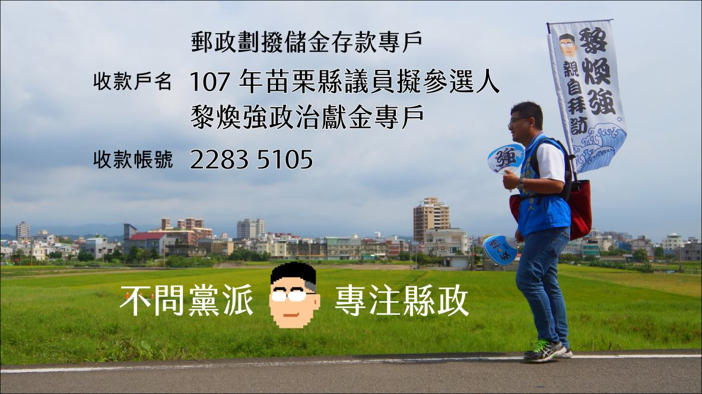

title: 苗栗縣議員參選人黎煥強，所有選舉經費
date: 2018-11-01 00:33:14
contentonly: true
description: "苗栗縣議員參選人 6 號黎煥強，所有小額捐款紀錄你都看得見！"
layout: "finance"
---

我是苗栗縣議員參選人黎煥強，我支持政治人物參選的時候，應該要公佈自己的選舉經費來源，以及使用明細。

這件事從 2014 年第一次參選就已實踐。我知道不容易，但是擺脫耗費鉅資的選舉文化，是台灣應該要努力的方向。

如果您願意，也支持我的理念。歡迎您以小額捐款的方式，支持黎煥強。只要到郵局劃撥，就能支持煥強

郵政劃撥儲金存款專戶
收款戶名：**107年苗栗縣議員擬參選人黎煥強政治獻金專戶**
收款帳號：**22835105**

還請您匯款後跟[煥強聯絡](https://www.facebook.com/dapangl1)，留下您的姓名、電話、地址。以利煥強向監察院申報並開立能抵稅的收據。

## 2018 選舉經費

* [contributions_2018.json](./contributions_2018.json)
    <!-- $ cat contributions_2018.json | jq ".entries[].price" | awk '{ sum += $1; } END { print sum; }' "$@" -->
    * 收入合計 505,200

* [cost_2018.json](./cost_2018.json)
    <!-- $ cat cost_2018.json | jq '.entries[].price' |awk '{ sum += $1; } END {print sum;}' "$@" -->
    * 支出合計 432,314

### 支出明細

<!--$ cat cost_2018.json | jq --raw-output ".entries[] | [.datetime, .name, .price, .comment] |@tsv" |awk '{print $1 " | " $2 " | " $3 " | " $4}'  -->

時間 | 名稱 | 金額 | 備註
-- | -- | -- | --
2018/04/23 | 競選背心 | 9000 |
2018/05/01 | 繡字 | 1600 |
2018/05/08 | 扇子 | 25200 | 5000份
2018/05/11 | 廣告面紙 | 34965 | 30000份
2018/05/11 | 廣告面紙 | 90930 | 20000份
2018/05/14 | 廣告宣傳品 | 12420 |
2018/05/19 | 立牌、標示版、布條 | 4500 |
2018/05/21 | 錦旗 | 1020 |
2018/05/27 | 飲料 | 2700 |
2018/06/01 | 後側背架 | 1050 |
2018/06/04 | 扇子 | 84000 | 20000份
2018/06/04 | 布條 | 500 |
2018/06/15 | 沙士 | 300 |
2018/06/20 | 拜訪卡 | 407 | 20盒
2018/07/12 | 沙士 | 300 |
2018/07/17 | 扇子 | 25200 | 5000份
2018/08/21 | 布旗 | 1000 | 2份
2018/08/24 | 布條+伸縮桿 | 3500 |
2018/08/25 | T恤 | 5050 |
2018/09/01 | 教學擴音器 | 990 |
2018/09/07 | 中空版牌 | 1500 |
2018/10/05 | 金香 | 460 |
2018/10/05 | 垃圾袋+打掃用具 | 668 |
2018/10/07 | 利樂包飲料 | 370 |
2018/10/07 | 古銅電話架/杯架 | 799 |
2018/10/08 | 堅果餅乾 | 1808 |
2018/10/08 | 拍立得 | 2803 |
2018/10/08 | 茶包 | 405 |
2018/10/09 | 紅布+花布 | 1050 |
2018/10/09 | 水果 | 600 |
2018/10/09 | 即可拍底片 | 5895 |
2018/10/09 | 文宣 | 2330 |
2018/10/09 | 電池 | 300 |
2018/10/10 | 音響喇叭租用 | 4000 |
2018/10/10 | 飲料杯水 | 1600 |
2018/10/10 | 蛋糕 | 1575 |
2018/10/10 | 肩帶 | 3800 | 2條
2018/10/10 | 主持費用 | 3000 | 欠支出傳票
2018/10/10 | 茶會點心 | 10000 |
2018/10/10 | 茶會點心 | 10000 |
2018/10/10 | 粽子 | 3600 |
2018/10/12 | B3 | 海報 | 1134100
2018/10/15 | 海報 | 1134 |
2018/10/18 | 摺紙DM | 3449 | 8000份
2018/10/19 | 印刷海報 | 9000 | 1面
2018/10/19 | 咖啡+紙杯 | 184 |
2018/10/23 | 氣球 | 3400 |
2018/10/24 | 燈具一批 | 3822 |
2018/10/26 | 桌椅租用 | 5000 |
2018/10/30 | 飲用機租用+桶裝水25桶 | 2205 |
2018/10/30 | 茶包 | 270 |
2018/10/30 | 圓規刀、美工刀 | 204 |
2018/11/01 | 廣告面紙 | 37800 | 30000份
2018/11/05 | 麥克筆 | 36 |
2018/11/05 | 麥克筆 | 32 |
2018/11/09 | 摺紙DM | 3449 | 8000份

### 收入明細

<!-- $ cat contributions_2018.json | jq --raw-output ".entries[] | [.datetime, .name, .price, .comment] |@tsv" |awk '{print $1 " | " $2 " | " $3 " | " $4}' -->

時間 | 名稱 | 金額 | 備註
-- | -- | -- | --
2018/05/18 | 徐〇強 | 10000 | 個人捐贈收入
2018/05/18 | 梁〇生 | 3000 | 個人捐贈收入
2018/05/18 | 石〇谷 | 5000 | 個人捐贈收入
2018/05/18 | 王〇顥 | 5000 | 個人捐贈收入
2018/05/18 | 陳〇臻 | 5000 | 個人捐贈收入
2018/05/18 | 彭〇顥 | 3000 | 個人捐贈收入
2018/05/18 | 邱〇芬 | 3000 | 個人捐贈收入
2018/05/18 | 楊〇廷 | 3000 | 個人捐贈收入
2018/05/18 | 李〇毅 | 3000 | 個人捐贈收入
2018/05/18 | 高〇奇 | 3000 | 個人捐贈收入
2018/05/18 | 劉〇郁 | 3000 | 個人捐贈收入
2018/07/06 | 陳〇田 | 10000 | 個人捐贈收入
2018/08/14 | 呂〇琪 | 60000 | 個人捐贈收入
2018/08/20 | 駱〇承 | 5000 | 個人捐贈收入
2018/09/11 | 林〇茵 | 20000 | 個人捐贈收入
2018/09/21 | 鍾〇青 | 50000 | 個人捐贈收入
2018/09/21 | 裴〇羚 | 10000 | 個人捐贈收入
2018/09/21 | 李〇良 | 5000 | 個人捐贈收入
2018/09/22 | 古〇源 | 1000 | 個人捐贈收入
2018/10/03 | 黎〇生 | 10000 | 個人捐贈收入
2018/10/03 | 黎〇旺 | 5000 | 個人捐贈收入
2018/10/08 | 黎〇倫 | 10000 | 個人捐贈收入
2018/10/08 | 黎〇倫 | 10000 | 個人捐贈收入
2018/10/08 | 陳〇妹 | 1000 | 個人捐贈收入
2018/10/08 | 溫〇春 | 5000 | 個人捐贈收入
2018/10/08 | 陳〇妹 | 1000 | 個人捐贈收入
2018/10/09 | 溫〇春 | 5000 | 個人捐贈收入
2018/10/11 | 古〇波 | 50000 | 個人捐贈收入
2018/10/11 | 黃〇招 | 50000 | 個人捐贈收入
2018/10/11 | 黃〇明 | 18000 | 個人捐贈收入
2018/10/11 | 洪〇華 | 18000 | 個人捐贈收入
2018/10/11 | 黃〇香 | 10000 | 個人捐贈收入
2018/10/11 | 呂〇霞 | 6000 | 個人捐贈收入
2018/10/11 | 張〇國 | 5000 | 個人捐贈收入
2018/10/11 | 羅〇傑 | 3000 | 個人捐贈收入
2018/10/11 | 張〇盛 | 3000 | 個人捐贈收入
2018/10/11 | 謝〇德 | 3000 | 個人捐贈收入
2018/10/11 | 莊〇宗 | 2000 | 個人捐贈收入
2018/10/11 | 謝〇英 | 2000 | 個人捐贈收入
2018/10/11 | 林〇珍 | 2000 | 個人捐贈收入
2018/10/11 | 楊〇堂 | 2000 | 個人捐贈收入
2018/10/11 | 劉〇松 | 2000 | 個人捐贈收入
2018/10/11 | 李〇毅 | 2000 | 個人捐贈收入
2018/10/11 | 許〇達 | 2000 | 個人捐贈收入
2018/10/11 | 楊〇靖 | 2000 | 個人捐贈收入
2018/10/11 | 簡〇明 | 2000 | 個人捐贈收入
2018/10/11 | 羅〇明 | 2000 | 個人捐贈收入
2018/10/11 | 姜〇芬 | 2000 | 個人捐贈收入
2018/10/11 | 鄭〇元 | 2000 | 個人捐贈收入
2018/10/11 | 湯〇彬 | 2000 | 個人捐贈收入
2018/10/11 | 劉〇富 | 2000 | 個人捐贈收入
2018/10/11 | 吳〇瑛 | 2000 | 個人捐贈收入
2018/10/11 | 范〇良 | 2000 | 個人捐贈收入
2018/10/11 | 朱〇一 | 2000 | 個人捐贈收入
2018/10/11 | 李〇琴 | 1200 | 個人捐贈收入
2018/10/11 | 陳〇添 | 1200 | 個人捐贈收入
2018/10/11 | 黃〇銘 | 1000 | 個人捐贈收入
2018/10/11 | 劉〇樺 | 1000 | 個人捐贈收入
2018/10/12 | 翔崴汽車有限公司 | 2000 | 企業捐款
2018/10/12 | 馮〇敏 | 10000 | 個人捐贈收入
2018/10/12 | 徐〇平 | 1200 | 個人捐贈收入
2018/10/12 | 謝〇昇 | 2000 | 個人捐贈收入
2018/10/12 | 謝〇剛 | 5000 | 個人捐贈收入
2018/10/15 | 有謙人力資源管理顧問有限公司 | 10000 | 企業捐款
2018/10/15 | 黃〇熊 | 2000 | 個人捐贈收入
2018/10/18 | 蘇〇庠 | 10000 | 個人捐贈收入
2018/10/18 | 黎〇樑 | 1600 | 個人捐贈收入
2018/10/18 | 鄭〇仁 | 3000 | 個人捐贈收入

## 2014 選舉經費

以下是我在 2014 年選舉的花費與政治獻金收入

* [cost_2014.json](./cost_2014.json)
* [contributions_2014.json](./contributions_2014.json)
* [監察院 - 政治獻金收支結算表](./10318038281.pdf)
    * 收入合計 150,014
    * 支出合計 160,318
    * 收支結存金額 -10,304

### 支出明細

名稱 | 金額 | 時間 | 備註
-- | -- | -- | --
Domain name | 562 | 2014/02/22 | toufen.net 網址。僅有電子發票
競選團隊背心 | 6000 | 2014/03/14 | 團隊 20 件，參選人 2 件
T-shirt | 1266 | 2014/03/14 | 慢跑 T-shirt
面紙 | 1890 | 2014/04/23 | 2000 包
文具 | 543 | 2014/04/23 | 看板製作
面紙 | 3087 | 2014/05/05 | 3000 包
DM | 840 | 2014/05/05 | 500 份，第一次試印
名片 | 900 | 2014/05/17 |
LED 燈板 | 1389 | 2014/05/21 |
LED 燈泡 | 500 | 2014/06/06 |
DM | 600 | 2014/06/12 | 250 份試印
面紙 | 4200 | 2014/06/17 | 6000 包
DM | 3800 | 2014/06 | 4000 份
荷葉扇 | 14000 | 2014/06 | 2000 份
保證金 | 50000 | 2014/09/05 |
餐費 | 920 | 2014/09/05 | 支付工作人員用餐費用
餐費 | 5300 | 2014/09/05 | 支付工作人員用餐費用
旗幟布料 | 535 | 2014/09/09 |
面紙 | 5670 | 2014/09/26 | 6000 包，選舉期間漲價了
DM | 2415 | 2014/10/07 | 第一版加印 2000
DM | 3990 | 2014/10/09 | 第二版 4000 份
外牆海報 | 1500 | 2014/10/15 |
總部成立賀禮 | 3000 | 2014/10/17 | 慶誌盆栽*3，恭賀其他候選人
競選肩帶 | 2400 | 2014/10/23 | 兩份
總部成立賀禮 | 1000 | 2014/10/31 | 慶誌盆栽*1，恭賀其他候選人
文宣 | 3780 | 2014/11/5 | 請柬\* 1000，小張DM\* 4000
背心號碼印工 | 450 | 2014/11/10 |
名片 | 945 | 2014/11/10 | 300張
金香 | 1170 | 2014/11/10 |
餐具 | 1000 | 2014/11/10 |
印章 | 80 | 2014/11/11 |
LED | 950 | 2014/11/13 | 外牆 LED 照明
文具 | 175 | 2014/11/14 | 筆、簽到簿
慶誌花籃 | 600 | 2014/11/14 |
慶誌盆栽 | 1000 | 2014/11/14 |
交通錐 | 400 | 2014/11/14 |
水果 | 8500 | 2014/11/14 | 成立大會使用
租借費用 | 5000 | 2014/11/15 | 成立大會租棉花糖機
佈置 | 24700 | 2014/11/15 | 總部成立會場布置(搭棚桌椅喇叭)
糖果瓜子 | 800 | 2014/11/15 | 成立大會使用
祭祀用水果 | 3700 | 2014/11/15 | 成立大會使用
米粉粽子各450人份 | 13980 | 2014/11/15 |
甜湯圓250人份 | 8000 | 2014/11/15 |
紅包子 | 430 | 2014/11/15 |
